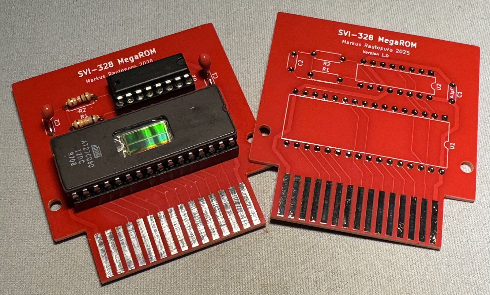
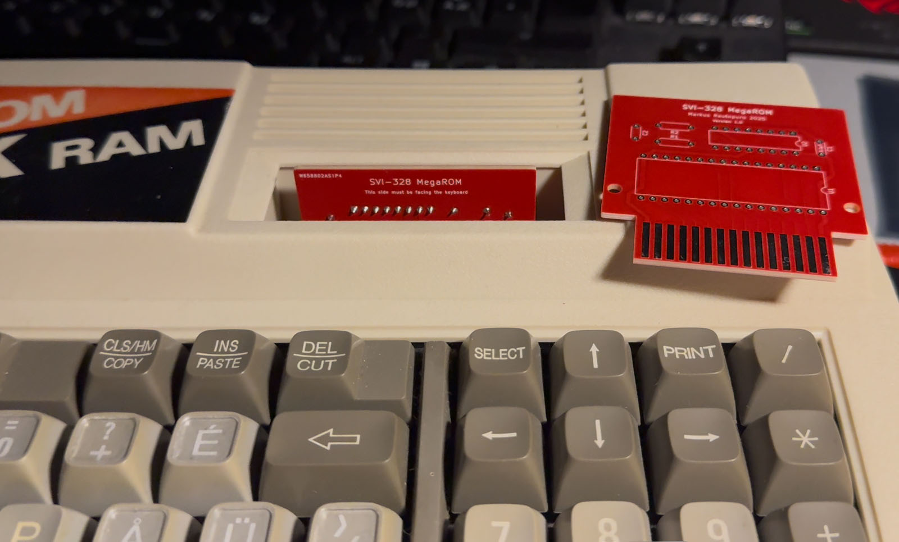
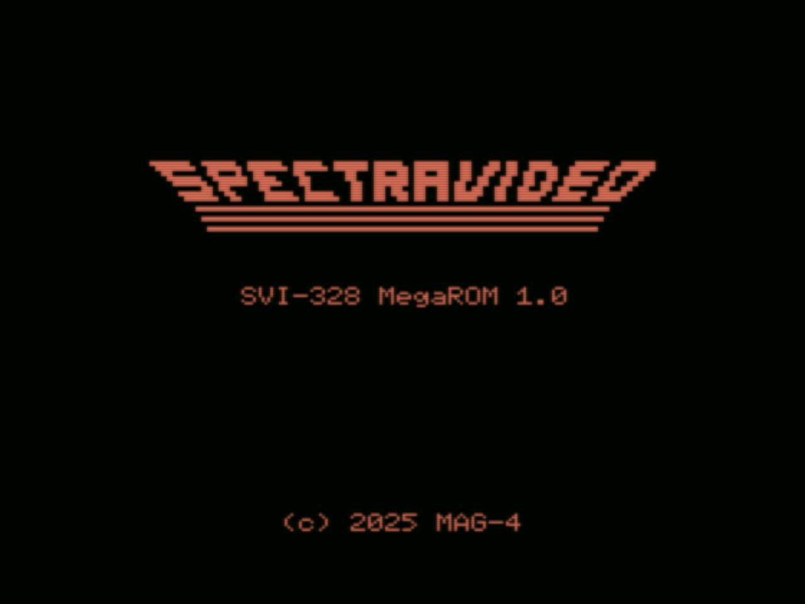
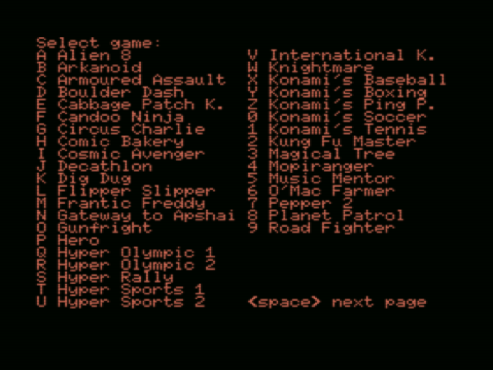
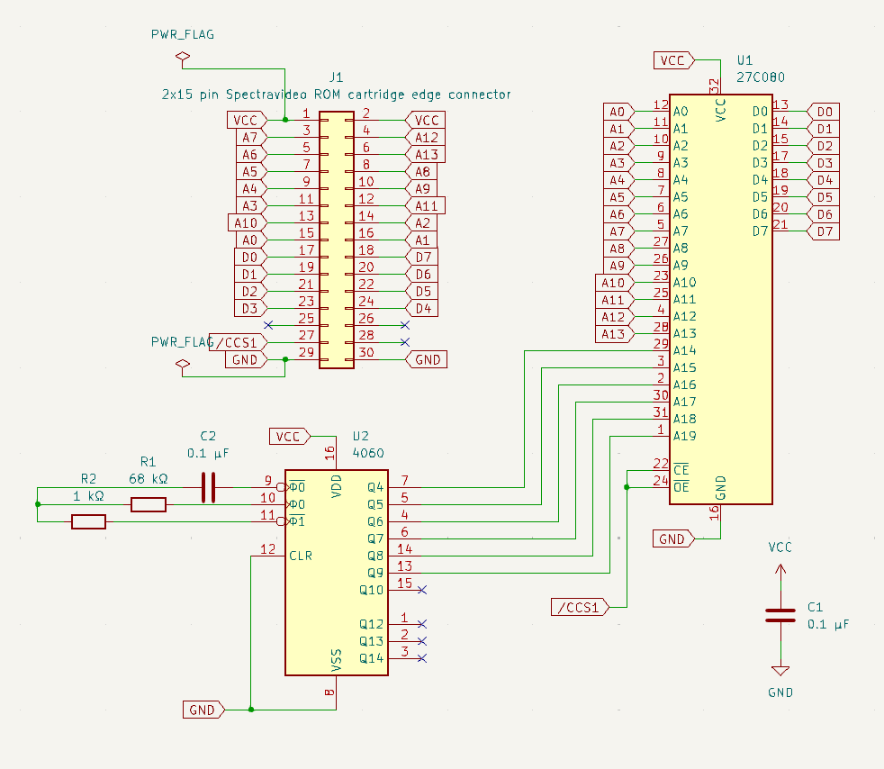
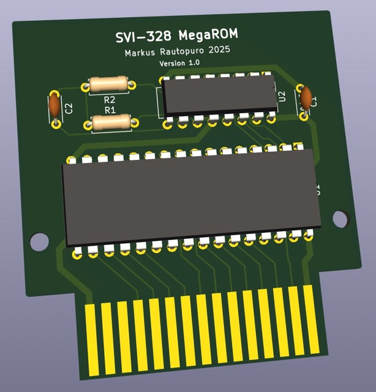

# SVI-328 MegaROM

## Overview

This is a 1024 kB (8 megabit) ROM cartridge for Spectravideo 328 that fits into a standard SVI-328 game cartridge slot without any hardware modifications.







The implementation is based on Timo Soilamaa's idea on having a CD4060 binary counter chip with a built-in oscillator to control high address lines of a large memory chip. This version exposes a 16 kB window of a larger 1024 kB at time to SVI-328 and changes the window to the next after a while has passed. A more thorough explanation on how it works is found in chapter [The hardware](#the-hardware) and [Cartridge ROM contents and operation](#cartridge-rom-contents-and-operation).

## Contents

This repository contains:
 - The source code for the ROM code (a game launcher) that can be burned into an EPROM memory chip.
 - The schematics and the layout of the PCB, which can be manufactured, for example, using [PCBWay](https://www.pcbway.com).
 - A tool (embedded to the makefile) that packs and chunks games into a format that the game launcher can handle on the device.

## System requirements

The implementation has been tested with macOS Sonoma 14.6.1 and requires the following software to be installed, and found from path when executing the `makefile`:
 - [z88dk version 2.3](https://github.com/z88dk/z88dk) (currently only z88dk-z80asm is used)
 - [openMSX emulator version 20.0](https://openmsx.org) (which should be installed in /Applications/openMSX.app)
 - [Node.js version 22.12.10](https://nodejs.org/en) or newer
 - [zx0 version 2.2](https://github.com/einar-saukas/ZX0)
 - [GNU M4](https://www.gnu.org/software/m4) (it should come with [Xcode](https://apps.apple.com/us/app/xcode/id497799835?mt=12) command line developer tools, tested with version 1.4.6)

## I don't have time to read this all :) 

Follow these instructions to get a version up and running in openMSX emulator.

### Create the ROM metadata

When you have installed the previous programs, get a ready 32 kB ROM image like Frantic Freddy, review [roms/roms.json.example](roms/roms.json.example) and create `roms/roms.json` with the following content:

    [
        {
            "name": "Frantic Freddy",
            "author": "Spectravideo",
            "file": "franticfreddy.rom.32.dat.zx0",
            "type": "rom.32.zx0",
            "jump": "0x000c",
            "crc16": "0x9c06"
        }
    ]

You can place the ROM image to `uncompressed_roms` folder with file name `franticfreddy.rom.32.dat` and then run `./calculate_crc16.sh` to see if the crc16 matches the example above. If it does, you're using the correct ROM image.

### Compress the ROM data

Now compress the ROM image using zx0 with `zx0 franticfreddy.rom.32.dat`. You should see something like this:

```
ZX0 v2.2: Optimal data compressor by Einar Saukas
[...............................................]
File compressed from 32768 to 8363 bytes! (delta 2)
```

Move `franticfreddy.rom.32.dat.zx0` to [roms](roms/) folder.

### Compile and run

Now, create an emulator version of the ROM image with `make emulator`.

Then, use `make run` to run the version in openMSX emulator.

### Load the game

You should now see the game selector on screen. Press A to load the game and then navigate to Memory debugger to do the following (to simulate the changing ROM window):
 - Write 0x01 to address 0x8000
 - Write 0x00 to address 0x8000
 - Write 0x01 to address 0x8000

The game should now load.

# The hardware

The cartridge design in inspired by [Noel Llopis' 32 kB cartridge](https://github.com/llopis/SVI328-ROM-Cartridge) for Spectravideo 328. The physical design, however, differs so that the edge connector is now exactly 40 mm wide making it align with the cartridge slot better.

The cartridge has the following components:
 - J1: A 30 pin edge connector that will fit the Spectravideo 328 cartridge slot
 - U1: An EPROM memory chip 27C080 (a UV EPROM version of the [AT27C080](https://ww1.microchip.com/downloads/en/DeviceDoc/doc0360.pdf)) 1024 kB (8 megabit)
 - U2: A 14-stage ripple-carry binary counter and oscillator chip CD4060 ([CD4060BE](https://www.ti.com/lit/ds/symlink/cd4060b.pdf))
 - R1: A 68 kΩ resistor, R2: A 1 kΩ resistor and C2: A 0.1 μF capacitor to provide the CD4060 1 / ( 2.3 * 0.0000001 F * 68000 Ω) = 63.93861893 Hz frequency to the oscillator, making Q3 go high after 8 clock cycles in ~125 milliseconds which is the rotation speed for the ROM windows
 - C1: A 0.1 μF capacitor acts as the decoupling capacitor to remove common noise and transient conditions

See chapter [Sector rotation](#sector-rotation) for information on how the CD4060 operates with the 27C080.





I recommend using a 32-pin spring socket under the memory chip so that it's easy to detach and attach the EPROMs.

# Cartridge ROM contents and operation

## Sector structure

The 1024 kB ROM memory is divided into 64 16384 byte sections (sectors), which consist of the following main parts:
1. The [loader](asm/loader.asm) (currently 16 bytes)
2. The sector data
3. The sector identifier (one byte, the last one in the sector)

Sector 0 (the first sector) contains the following functionality in the sector data (2.) section:
 - [decompressor](asm/decompressor.asm) which sets up the zx0 decompressor in high RAM (`DZX0_ADDRESS`) and also copies the launcher to high RAM (`LAUNCHER_ADDRESS`, see [makefile](makefile) for the values)
 - [launcher](asm/launcher.asm) which displays the game selector, chooses the right game loader and executes the game loading sequence and starts the game

Other sectors (from 1 to 63) contain the game data. This will be explained in chapter [Game data](#game-data).

## Sector rotation

The 1024 kB of a 27C080 is accessed via address lines A0..A19 (2^20 bytes) the following way:
 - The SVI-328 cartridge connector addressess directly the first A0..A13 (2^14 = 16384) bytes when Cartridge ROM bank (bank xx, when /CART is low) is accessed from memory addressess 0x0000 - 0x3fff.
 - Accessing these addresses will also set /CCS1 line low. This line is used to enable the 27C080 memory chip using /OE (output enable) and /CE (chip enable).
 - The CD4060 counter chip coordinates address lines A14 to A19.

The binary counter starts from 0, when all the Qx lines are low (zero). After 8 clock cycles line Q3 goes high (~125 ms) and sets A14 high (1). This will make the 270C080 address pointer point to the 2nd 16 kB block and so on. Cycling through all the 16 kB sectors takes ~8 seconds in this configuration.

As each of the sectors contain the sector identifier byte (starting from 0x00 in sector 0, continuing as 0x01 in sector 1 and so on), you can always check which sector is visible by reading the memory address 0x3fff (when bank xx is selected by setting /CART low [using the PSG](asm/launcher/psg.asm)).

The ~125 ms rotation speed is based on that then the CPU has enough time to read the 16 kB of sector data and write it to RAM using [FastLDIR](asm/launcher/fast_ldir.asm) memory copying function.

## Boot up procedure

When the SVI-328 is booted up with the cartridge ROM attached, it follows these phases:

1. When a cartridge ROM is attached, /CART is set low and the memory bank mapping the cartridge ROM contents to 0x0000 - 0x7fff is enabled. (However, we will only use the first 16 kB between 0x0000 - 0x3fff, the contents between 0x4000 - 0x7fff are undefined.)
2. The [loader](asm/loader.asm) is visible at memory address 0x0000 (every sector starts with the loader, so it's always visible at this address). The loader starts with `di` and `ld sp, xxxx` instructions which instructs the SVI-328 that we have a valid cartridge ROM attached.
3. The loader waits until sector 0 has passed (not displaying sector 0) and then waits again until sector 0 is visible again. This is to ensure that the CPU will have enough time to copy the launcher from sector 0 to RAM.
4. Next, the [decompressor](asm/decompressor.asm) will copy the zx0 decompressor to end of RAM at address `DZX0_ADDRESS` (so it won't get overwritten later) and also a compressed copy of the [launcher](asm/launcher.asm) to address 0xc000. Then, the launcher is decompressed to address `LAUNCHER_ADDRESS`.
5. At last, the launcher execution is started in RAM at address `LAUNCHER_ADDRESS`.

## Launcher

The [launcher](asm/launcher.asm) consists of the following sections:

1. [Splash screen](asm/launcher/splash.asm) displayed first when the ROM cartridge boots
2. [Game selector](asm/launcher/game_selector.asm), which let's the user choose the game to be loaded
3. [MSX ROM-loader](asm/MSX/LICENSE) initialization, which prepares MSX ROM games to be loaded and converted (when ROM type is MSX, see chapter [Game data](#game-data))
4. Compressed game data copying to RAM ([launcher](asm/launcher.asm), starts from label `.load_another_part:`)
5. Decompression and jumping routines for different game ROM types

# Game data

## Overview

The launcher supports different types of game or applicaton ROM images, these are explained in the next chapters.

`gamedata.js` processes the `roms.json` and outputs corresponding sector data files into `build` directory and also generates `gamedata.asm` to be used for the game launch metadata when building the final ROM.

## cas.8 and cas.16

`cas.8` and `cas.16` are uncompressed 8 kB or 16 kB images based on .cas file data. An example of a typical `cas.16` game is Mass Tael's Spectravideo games like Turboat or SASA.

`gamedata.js` defaults these ROMs to have a jump and load address of `0x8800`, which you can override with `jump` or `load` keys if needed.

The following is an example on how to configure a 16384 byte image to be launched using `roms.json`:

    {
        "name": "SASA",
        "author": "Mass Tael",
        "file": "sasa.cas.16.dat",
        "type": "cas.16",
        "crc16": "0x166f"
    }

## cas.16.zx0

`cas.16.zx0` is a compressed version of the `cas.16` image.

## rom.32.zx0

`rom.32.zx0` is a compressed 32 kB ROM image.

The following is an example on how to configure a 32768 byte image to be launched using `roms.json`:

    {
        "name": "Frantic Freddy",
        "author": "Spectravideo",
        "file": "franticfreddy.rom.32.dat.zx0",
        "type": "rom.32.zx0",
        "jump": "0x000c",
        "crc16": "0x9c06"
    }

In this case, a non-standard jump address of 0x000c is needed in order for the Frantic Freddy ROM code not to switch /CART low again.

## msx.32.pletter

`msx.32.pletter` is a 32 kB MSX ROM packed with Pletter. This is the format the [MSX ROM-loader for SVI-328](asm/MSX/license.txt) uses by default. However, it is recommended to use `msx.32.zx0` as it packs the games smaller.

Note that with this ROM type you need to split the 32 kB ROM into two 16 kB parts and pack them individually. The following is an example on how to configure a 32768 byte image to be launched using `roms.json`:

    {
        "name": "Arkanoid",
        "author": "Taito",
        "files": [
            "arkanoid.msx.32.part1.dat.pletter",
            "arkanoid.msx.32.part2.dat.pletter"
        ],
        "type": "msx.32.zx0"
    }

## msx.32.zx0

'msx.32.zx0' is a 32 kB MSX ROM packed with ZX0. It is required to split the 32 kB ROM into two 16 kB pieces and then packing them. Please use the script [split_roms.sh](scripts/split_roms.sh) to split the original ROM and pack the pieces with ZX0.

The following is an example on how to configure a 32768 byte MSX image to be launched using `roms.json`:

    {
        "name": "Zanac",
        "author": "Compile",
        "files": [
            "zanac.msx.32.part1.dat.zx0",
            "zanac.msx.32.part2.dat.zx0"
        ],
        "type": "msx.32.zx0"
    }

## msx.16.zx0

'msx.16.zx0' is a 16 kB MSX ROM packed with ZX0. It can be supplied in single file.

The following is an example on how to configure a 16384 byte MSX image to be launched using `roms.json`:

    {
        "name": "Boulder Dash",
        "author": "First Star Software",
        "file": "boulderdash.msx.16.dat.zx0",
        "type": "msx.16.zx0"
    }

## rom.48.zx0

'rom.48.zx0' is a SVI-328 game that has 48 kB size. Note that this is not a ROM image as SVI-328 48 kB ROMs are virtuallu non-existent and the physical ROM cartridges operate a little differently than 32 kB ROMs.

Compiling the production ROM with `make production` shows the maximum compressed image file size that can be loaded in single part:

`Maximum compressed ROM size in this build: 31898`

If the compressed image exceeds that size, you need to split the image into parts using [split_roms.sh](scripts/split_roms.sh) script.

Here are examples of games with compressed size less than ~31k and larger:

    {
        "name": "Gunfright",
        "author": "Ultimate Play the Game",
        "file": "gunfright.rom.48.dat.zx0",
        "type": "rom.48.zx0"
    }

    {
        "name": "Knightmare",
        "author": "Konami",
        "files": [
            "knightmare.rom.48.part1.dat.zx0",
            "knightmare.rom.48.part2.dat.zx0"
        ],
        "type": "rom.48.zx0"
    }


## cas.len.zx0

'cas.len.zx0' is a format which has a variable size (other than 8 or 16 kB).

In this ROM type, you need to supply the uncompressed game length using `length` parameter.

    {
        "name": "Hero",
        "author": "Activision",
        "file": "hero.cas.len.dat.zx0",
        "type": "cas.len.zx0",
        "crc16": "0x0ecb",
        "load": "0x8000",
        "jump": "0x8000",
        "length": "17153"
    }

# Compiling the production version

To compile the production version of the ROM cartridge image, please use `make production`. 

If the build prosess reports an error (see below) about modifying `SECTOR0_START`, you need to supply a larger value to the `makefile`.

    z88dk-z80asm -o=build/sector0.bin -DSECTOR0_START=9100 -DLAUNCHER_ADDRESS=0x8001               -DDZX0_ADDRESS=65468                    -m -l -b -DROM_ID=0 build/rom1024.asm -I=asm
    build/rom1024.asm:24: error: integer range: -$3e6
    ^---- defs SECTOR0_START-$, 0xff ; If this fails, increase SECTOR0_START in makefile
        ^---- defs SECTOR0_START-$,255

If you supplied a value large enough, the build process successfully completes and suggests the actual value:

    Magic number (use this in makefile): 10095
    Maximum compressed ROM size in this build: 31943
    1024 kB version compiled (release/cart1024.rom)

To optimize the ROM cartridge usage you should use the provided Magic number as `SECTOR0_START` value. In some cases, even if you supply the exact magic number, the build process still can crash with a following type of error:

    build/rom1024.asm:24: error: integer range: -1
    ^---- defs SECTOR0_START-$, 0xff ; If this fails, increase SECTOR0_START in makefile
        ^---- defs SECTOR0_START-$,255

Then, just increase `SECTOR0_START` with one or two, rebuild and keep doing this until it successfully builds the ROM image. As supplying a different value will change the contents of the launcher image, and once it is compressed with different contents, the resulting image lenght may vary. This makes it impossible to know the resulting compressed launcher image size in beforehand.

You will find the resulting ROM image from `release/cart1024.rom`.

# Burning the EPROM

To burn the ROM image to an EPROM, you can use [minipro](https://formulae.brew.sh/formula/minipro) version 0.7.2 on macOS. Use the following command with AT27C080 with DIP32 pins:

```
minipro -p AT27C080@DIP32 -w cart1024.rom
```

For the EPROM burner, I'm suggesting a [TL866II Plus](https://www.amazon.de/dp/B07KM3J7CZ) programmer. To erase the UV EPROMS you can use a [UV EPROM eraser](https://www.amazon.de/-/en/dp/B000M5AJ8Q).

I had to update the programmer firmware first with a Windows machine in order to get it to work on macOS. See the details of the minipro output below:

```
Found T48 01.1.31 (0x11f)
Warning: T48 support is experimental!
Device code: 44A13469
Serial code: VTQRRFJKXR60YE8R9I6Y4274

VPP=13V, VDD=6.5V, VCC=5V, Pulse=50us
Chip ID: 0x1E8A  OK
Writing Code...  257.18Sec  OK
Reading Code...  7.25Sec  OK
Verification OK
```

# Special thanks

This cartridge ROM is based on Timo Soilamaa's idea on using the binary counter chip as the address mapper. I would like to thank Timo also on providing valuable information about the Spectravideo 328 hardware, some hands-on testing and advice on using the MSX ROM-loader for SVI-328.

The PCB design is inspired by [Noel Llopis' SVI-328 32 kB cartridge](https://github.com/llopis/SVI328-ROM-Cartridge) project.

I've also gotten useful information from Duncan Morrison about .CAS files and the information about 32 kB and 64 kB ROMs from Tony Cruise.

# Embedded source code and their license

For license of using this source code and hardware, please see [LICENSE](LICENSE). 

The ROM code includes [EXEROM](asm/MSX/EXEROM) binary from MSX ROM-loader for SVI-328 version 1.5 by NYYRIKKI. See the licensing information from [here](asm/MSX/LICENSE).

Also, the launcher uses [ZX0 "Standard" decompressor](asm/ZX0/dzx0_standard.asm) by Einar Saukas & Urusergi. See the licensing information from [here](asm/ZX0/LICENSE).